# EvidAnce — Clinical Evidence Agent

> **Evidence + Guidance** — A multi-source clinical evidence agent built for West African healthcare contexts.

[](https://djangoproject.com/)
[](LICENSE)

---

## 🌟 The Vision

EvidAnce is a clinical evidence retrieval and synthesis agent tailored for low-resource and West African clinical environments. It searches real medical databases in parallel, filters and scores research based on its applicability to African populations, and synthesises answers grounded in evidence, comparative standards, and local clinical guidelines.

### Crucial Differentiators:
1. **Multi-Source parallel RAG:** Query PubMed, Europe PMC, Semantic Scholar, OpenAlex, WHO IRIS, OpenFDA, ClinicalTrials.gov, and DOAJ in parallel.
2. **West African Population Grounding:** Automatic region-tagging, disease-focus weighting, and explicit alerts for population/cohort mismatch.
3. **Antigravity Dark IDE UI:** A premium, dark-purple interface modeled after modern coding IDEs, with live collapsible step-trace logs, active-source tool badges, a collapsible clinician scratchpad (**Researcher Canvas**), and fully persistent settings.
4. **Report Export:** Instantly download high-quality clinician-branded PDF consultation summaries.

---

## 📐 Architecture & Flow

```mermaid
flowchart TD
    User([User Question]) --> Classify{Intent Classifier}
    
    Classify -->|CONVERSE: General talk| DirectDirect[Direct Groq Llama3 response]
    Classify -->|SOURCE_REQUEST: Evidence search| ProcessQuery[Rewrite Query & Inject Region Bias]
    
    ProcessQuery --> SearchParallel{Parallel Orchestrator}
    
    SearchParallel -->|PubMed| PM[PubMed E-Utilities API]
    SearchParallel -->|Europe PMC| EPMC[Europe PMC REST API]
    SearchParallel -->|Semantic Scholar| S2[Semantic Scholar API]
    SearchParallel -->|OpenAlex| OA[OpenAlex API]
    SearchParallel -->|WHO IRIS| WHO[WHO IRIS OAI-PMH]
    SearchParallel -->|OpenFDA| FDA[OpenFDA API]
    SearchParallel -->|ClinicalTrials.gov| CT[ClinicalTrials.gov v2]
    SearchParallel -->|DOAJ| DOAJ[Directory of Open Access Journals]
    
    PM & EPMC & S2 & OA & WHO & FDA & CT & DOAJ --> Score[Weighted Composite Relevance Scorer]
    
    Score --> Chunks[Overlapping overlap chunking]
    Chunks --> FAISS[FAISS Vector Index FlatIP]
    FAISS --> Retrieve[Cosine similarity extraction]
    
    Retrieve --> Synthesise{Synthesis Engine}
    Synthesise -->|Guideline Match| STG[Apply Ghana Standard Treatment Guidelines]
    Synthesise -->|No Mismatch| FinalAnswer[Grounded Answer with Citations]
    
    FinalAnswer --> UI[Render HTML, Live Step Trace, Canvas updates, Follow-ups, PDF]
```



---

## 🎛️ Retrieval & Scoring Core

### 1. Weighted Composite Relevance Score
To ensure the most high-quality and population-relevant research reaches the top, every paper is evaluated using a composite scoring algorithm:

$$\text{Relevance} = 0.40 \times \text{Semantic Score} + 0.25 \times \text{Evidence Tier} + 0.20 \times \text{Region Score} + 0.15 \times \text{Recency Score}$$

- **Semantic Score (40%):** Cosine similarity between query vector and abstract vector using `all-MiniLM-L6-v2`.
- **Evidence Tier (25%):**
  - Systematic Review / Meta-analysis: `1.0`
  - Guideline / Official Protocol: `0.9`
  - Randomized Controlled Trial: `0.8`
  - Observational (Cohort / Case-control): `0.6`
  - Other (Opinion / Case report): `0.4`
- **Region Score (20%):**
  - `regional` (West African cohort or conducted in West Africa): `1.0`
  - `adjacent` (sub-Saharan or broader Africa cohort): `0.7`
  - `extrapolated` (no African context, global): `0.4`
- **Recency Score (15%):** Linear decay from `1.0` (current year) to `0.0` (20+ years ago).

---

## 📦 App Directory Structure

The project is structured as modular, clean Django applications:

```
clinicalrag/
│
├── config/                  # Django root configuration
│   ├── asgi.py              # Channels routing
│   ├── settings.py          # Unified settings
│   └── urls.py              # URL routing registry
│
├── api/                     # Legacy core RAG engine, prompt files, PDF module
│
├── sources/                 # Parallel evidence sources (Spec §3)
│   ├── schema.py            # Unified Result dataclass + Region/Tier classifiers
│   ├── europepmc.py         # Europe PMC source
│   ├── semanticscholar.py   # Semantic Scholar source
│   ├── openalex.py          # OpenAlex source
│   ├── whoiris.py           # [P1] WHO IRIS OAI-PMH collection
│   ├── openfda.py           # [P1] OpenFDA labels
│   ├── clinicaltrials.py    # [P1] ClinicalTrials.gov v2
│   └── doaj.py              # [P1] Directory of Open Access Journals
│
├── retrieval/               # Orchestration & scoring (Spec §3.3)
│   ├── orchestrator.py      # Thread-pool fan-out, deduplication, cosine similarity
│   └── views.py             # Server-Sent Events (SSE) streaming API
│
├── canvas/                  # Scratchpad & Patient Context (Spec §6.4)
│   ├── models.py            # CanvasSession db schema
│   └── views.py             # GET/PATCH/DELETE endpoints
│
├── settings_profile/        # Persisted clinician configuration (Spec §7)
│   ├── models.py            # EvidanceSettings db schema
│   └── views.py             # GET/PATCH endpoints
│
├── templates/
│   └── index.html           # Single-page Antigravity IDE Dark UI
```

---

## 🚀 Live Implementation Status

| Milestone | Feature | Status |
|---|---|---|
| **P0** | Core Infrastructure (Django Channels, SQLite, FAISS) | ✅ Complete |
| **P0** | Premium Antigravity Dark Purple CSS Design System | ✅ Complete |
| **P0** | Europe PMC, Semantic Scholar, OpenAlex Integration | ✅ Complete |
| **P0** | Parallel Orchestrator & Deduplication Scorer | ✅ Complete |
| **P0** | Live SSE Progress step-trace UI & citations | ✅ Complete |
| **P0** | Settings backend profile & Anonymous Canvas sessions | ✅ Complete |
| **P1** | Settings UI Integration (Toggles, focus, region) | ✅ Complete |
| **P1** | WHO IRIS source integration | ✅ Complete |
| **P1** | OpenFDA source integration | ✅ Complete |
| **P1** | ClinicalTrials.gov v2 integration (Location-aware) | ✅ Complete |
| **P1** | DOAJ (Directory of Open Access Journals) integration | ✅ Complete |
| **P1** | West Africa Region & Observational Tier Classifier | ✅ Complete |
| **P1** | Active Sources "Tools" Popover dropdown | ✅ Complete |
| **P2** | AJOL, Cochrane, and WHO AFRO scrapers | ⏳ Scheduled |
| **P2** | Trust badges & Drug dosage calculator | ⏳ Scheduled |
| **P3** | Advanced PDF formatting, Ghana HS scraping | ⏳ Scheduled |

---

## 🛠️ Installation & Execution

### 1. Requirements
Ensure you have Python 3.10+ installed.

### 2. Setup environment
Create a `.env` file at the root:
```env
DEBUG=True
SECRET_KEY=dev-key-random-string
ALLOWED_HOSTS=localhost,127.0.0.1
GROQ_API_KEY=gsk_your_actual_key_here
```

### 3. Run migrations and start server
```bash
pip install -r requirements.txt

python manage.py makemigrations canvas settings_profile sources
python manage.py migrate
python manage.py runserver
```

Visit `http://127.0.0.1:8000/` to test.

---

## 🧑‍⚕️ Disclaimer

*EvidAnce is a clinical research and decision-support prototype. It does not replace professional clinical judgement or official national treatment guidelines. Always verify dosing and treatments before administering clinical care.*
